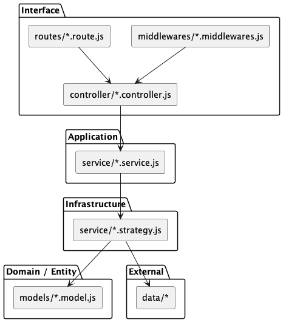

# lw_2_1 Проєкт на Node.js (JSON + XML API)
CRUD-застосунок на Node.js для керування студентами (імʼя, прізвище, по батькові, освіта, факультет), із збереженням у форматах JSON та XML.

## Функціонал:
- Додавання, оновлення, видалення, перегляд студентів
- Підтримка формату XML та JSON
- Валідація на сервері

## Запуск:
```bash
npm install
npm run start
```

## Відкрити в браузері
[http://localhost:3000/index.html](http://localhost:3000/index.html)

## Приклад запиту
```bash
curl
  -X POST http://localhost:3000/api/json
  -H "Content-Type: application/json"
  -d '{"name":"Іван","lastname":"Петренко","surname":"Олексійович","education":"НАУ","faculty":"ПІ"}'
```

## Архітектура проекта

